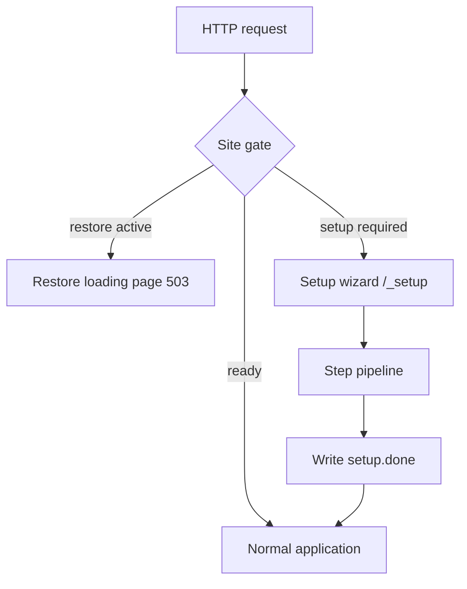
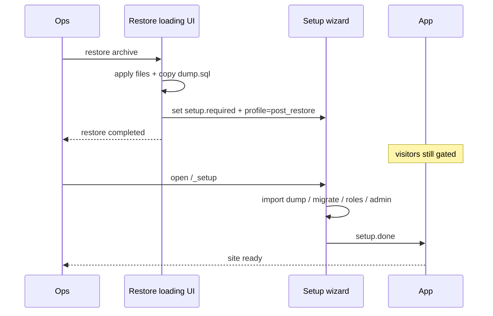

# Setup Wizard (cold start & post-restore)

## Table of contents

- [Problem](#problem)
- [Product idea](#product-idea)
- [Modes and site gate](#modes-and-site-gate)
- [UI flows](#ui-flows)
- [Wizard engine](#wizard-engine)
- [Built-in step types](#built-in-step-types)
- [Configuration (polyvalent)](#configuration-polyvalent)
- [Profiles](#profiles)
- [Security](#security)
- [Idempotency contract](#idempotency-contract)
- [Integration with backup / restore](#integration-with-backup--restore)
- [Locale-in-path (dual URLs)](#locale-in-path-dual-urls)
- [Twig overrides](#twig-overrides)
- [CLI](#cli)
- [Events](#events)
- [Implementation roadmap](#implementation-roadmap)

## Problem

Two situations leave the site **unusable** if you only show a static loading page:

1. **Fresh install** — no database (or empty schema), no admin user, no seed data.
2. **Restore from scratch** — files restored, but DB missing / dump not imported / migrations not applied.

Operators need a **guided UI** that can create the DB, run schema/migrations, load minimal SQL, run idempotent loaders, create a super-admin, and optionally load demo data — without SSH for every project.

## Product idea

Extend Site Backup with a **Setup Wizard** (same bundle, separate subsystem under `setup:`):

| Concern | UI | Goal |
| --- | --- | --- |
| **Restore** | Loading page (progress bar) | Don’t serve a half-restored app |
| **Setup** | Multi-step wizard | Bring an empty/broken DB to a bootable app |

One **site gate** decides what visitors see. The wizard is **declarative and pluggable** so each app defines its own pipeline (Doctrine, SQL files, custom commands, own User entity).



## Modes and site gate

Priority (first match wins):

1. **Restore mode** — `RestoreProgress.active` → restore loading page (existing behaviour).
2. **Setup mode** — any `SetupNeedDetectorInterface` says “needed” → wizard (until `setup.done` clears the gate).
3. **Ready** — normal kernel.

Detectors (wired in `SetupNeedEvaluator` via tag `nowo.site_backup.setup_need_detector`; built-ins toggled under `setup.detectors`):

| Detector | When it triggers |
| --- | --- |
| `MarkerFileDetector` | `var/site-backup/setup.required` exists or `setup.done` missing (when `require_done_marker: true`) |
| `DoctrineConnectDetector` | DBAL cannot connect |
| `DoctrineSchemaEmptyDetector` | connected but no tables |
| `IncompleteSetupProgressDetector` | progress phase is `running` / `waiting_input` / `failed` (and `setup.done` is absent) — resumes mid-wizard even if markers/`var/` were wiped when using Doctrine/`chain` storage |
| **Custom (app)** | `#[AsSetupNeedDetector(priority: …)]` + `SetupNeedDetectorInterface` (same idea as tab `#[AsSetupTabChecker]`) |

**Gate detector ≠ tab checker.**

| Concern | API | Wired by |
| --- | --- | --- |
| Site gate “open setup?” | `SetupNeedDetectorInterface` + `#[AsSetupNeedDetector]` | Tag `nowo.site_backup.setup_need_detector` → `SetupNeedEvaluator` |
| Wizard tab needs input / blocked | `SetupTabCheckerInterface` + `#[AsSetupTabChecker]` | Profile YAML `checker: App\Setup\MenusTabChecker` |

Do not write `setup.required` from an app subscriber to encode app health — register a detector instead (avoids sticky markers across container recreates).

```php
use Nowo\SiteBackupBundle\Attribute\AsSetupNeedDetector;
use Nowo\SiteBackupBundle\Setup\SetupNeedDetectorInterface;

#[AsSetupNeedDetector(priority: 50)]
final class PlatformCatalogsSetupNeedDetector implements SetupNeedDetectorInterface
{
    public function isSetupRequired(): bool { /* menus / breadcrumbs missing? */ }

    public function getReason(): string { return 'platform catalogs missing'; }
}
```

Tab example (unchanged — not a gate detector):

```yaml
tabs:
  - type: custom
    id: menus
    label: setup.tab.custom
    checker: App\Setup\MenusTabChecker   # SetupTabCheckerInterface
    runner:
      type: console
      command: 'app:menus:sync'
```

### Progress storage

| `setup.progress_storage` | Behaviour |
| --- | --- |
| `filesystem` (default) | JSON at `setup.progress_file` (`var/site-backup/setup-progress.json`) |
| `doctrine` | Singleton row in DBAL table `setup.progress_table` (default `nowo_site_backup_setup_progress`); table auto-created on first write |
| `chain` | Write JSON **and** DB when possible; **load prefers DB** so wiping `var/` does not lose the current step |

Progress payload includes `started_at`, `current_step_id`, `phase`, `percent`, `completed_at`, plus log/answers.

After a successful wizard finish: write `setup.done`, remove `setup.required`, emit `SetupCompletedEvent`.

During setup, the gate **blocks** the rest of the site (503 or soft redirect to `/_setup`) except:

- wizard routes (`/_setup`, `/_setup/api/*`, and `/{_locale}/_setup…` when `setup.locale.in_path` is `always`/`both`)
- health exclusions
- optional restore panel (ops)

## UI flows

### A — Fresh install (no DB)

```
/_setup
  1. Welcome + requirements checklist (PHP ext, tar, writable var/)
  2. Bootstrap mode:
       • Guided — create admin later in the wizard
       • Full database — import a .sql dump (skips admin form if users exist)
  3. Database DSN form (optional; skip if DATABASE_URL already works)
  4. Create DB + cache clear
  5. If full database: import SQL (path or var/site-backup/full-import.sql)
  6. Migrations (idempotent) + optional app console/SQL loaders (menus, breadcrumbs, …)
  7. Create initial super-admin (form) — skipped when skip_if_admin_exists and users present
  8. Optional: “Load sample data?” (yes/no) when configured
  9. Done → link to login / homepage
```

Starting the wizard marks `setup.required` so visitors stay on `/_setup` until `setup.done` is written. For greenfield apps that must never serve the app before setup, set `require_done_marker: true`.

### B — Post-restore (files OK, DB cold)

Same wizard, **profile** `post_restore`:

- Prefer `import_sql` from `var/site-backup/last-restore-dump.sql` when present
- Then migrations (if dump was schema-only) or skip schema when dump is full
- Skip sample data by default
- Still offer “create admin” only if no users table row matches provisioner check

### C — Headless / CI

```bash
php bin/console nowo:site-backup:setup --profile=fresh_install --no-interaction \
  --admin-email=ops@example.com --admin-password=...
```

Same pipeline as the UI; interactive steps fail unless options are passed.

### UI chrome (single composition)

Public setup surface (not a dashboard of cards):

- Brand / app name (from config)
- One headline + one short line
- Step indicator (1…N)
- Main panel = current step only
- Footer: Back / Continue (or auto-advance on runner steps)

Templates under `@NowoSiteBackupBundle/setup/…` (REQ-TWIG-001 overridable).

Progress for long steps: poll `GET /_setup/api/progress` (same pattern as restore `progress.json`).

## Wizard engine

### Contracts

```php
interface SetupStepInterface
{
    public function getId(): string;
    public function getLabel(): string;
    /** @return 'auto'|'form'|'confirm' */
    public function getUiKind(): string;
    public function isEnabled(SetupContext $ctx): bool;
    public function isComplete(SetupContext $ctx): bool; // idempotent skip
    public function run(SetupContext $ctx, SetupStepInput $input): SetupStepResult;
}

interface SetupNeedDetectorInterface  // site gate (tagged); not a tab checker
{
    public function isSetupRequired(): bool;
    public function getReason(): string;
}

interface AdminUserProvisionerInterface
{
    public function adminExists(): bool;
    /** @param array{email: string, password: string, roles?: list<string>} $data */
    public function createAdmin(array $data): void;
}
```

`SetupContext` holds: profile name, project dir, progress storage, bag of answers (DSN, flags), selected options (sample data yes/no).

`SetupOrchestrator`:

1. Resolve profile → ordered step ids
2. Skip steps where `isComplete()` is true
3. Run next step; persist progress JSON
4. On form steps, wait for POST input
5. On failure: mark failed, keep UI on that step with error (retryable)

Steps registered via:

- YAML declarations (built-in types), and/or
- Tagged services `nowo.site_backup.setup_step`

## Built-in step types

| Type | What it runs | Notes |
| --- | --- | --- |
| `requirements` | PHP version, extensions, writable dirs | Form = checklist UI only |
| `database_url` | Validate / optionally write `.env.local` | Never commit secrets; optional |
| `console` | `Process` → `php bin/console …` | Timeout = `process_timeout` |
| `database_create` | `doctrine:database:create --if-not-exists` | Shortcut over `console` |
| `cache_clear` | `cache:clear` | Always before schema when configured |
| `schema_update` | `doctrine:schema:update --force` | Mutually exclusive with migrate in same profile (or ordered explicitly) |
| `migrations` | `doctrine:migrations:migrate --no-interaction` | Preferred for apps that ship migrations |
| `sql_file` | Execute `.sql` paths (glob); honour answer `sql_import_path` | Seed / full dump import |
| `bootstrap_mode` | Form: `guided` \| `full_database` (+ optional path) | Sets answers for `when_answer` |
| `admin_user` | Calls `AdminUserProvisionerInterface` | Skipped when admin exists |
| `sample_data` | Runs configured console commands | Only if user opted in |
| `marker` | Write/remove lock files | `setup.done`, clear `setup.required` |
| `custom` | App Twig + optional `runner` / `checker` | Declared under `profiles.*.tabs` |

Generic **`console`** is the escape hatch: any idempotent app command (`app:load-taxonomy`, `app:seed-roles`, …).

## Tabs, checkers, and advance mode

Prefer **`setup.profiles.<name>.tabs`** (ordered). When `tabs` is non-empty it replaces `steps` for that profile. Each tab may set:

| Field | Role |
| --- | --- |
| `label` / `description` | Translation ids (`label_domain` default `NowoSiteBackupBundle`) |
| `checker` | Service id / FQCN implementing `SetupTabCheckerInterface` (`ok` / `needs_input` / `blocked`) |
| `template` | Optional Twig body for `waiting_input` — prefer a **bundle** logical name (see below) |
| `runner` | Nested built-in step (e.g. `console`) when `type: custom` |

`#[AsSetupTabChecker]` tags the service; YAML still binds it with `checker: …`.

`advance_mode: automatic|manual` (global `setup.advance_mode` or per profile): automatic chains auto tabs until interaction; manual runs one auto tab per Continuar. Interactive tabs always pause. Headless CLI always behaves as automatic.

### Reusable Twig (REQ-TWIG-001 / REQ-UI-001)

Bundle templates are the **default product UI**. Apps should:

1. **Use the shipped wizard** (`@NowoSiteBackupBundle/setup/...`) so `composer update` keeps UX improvements without re-implementing screens.
2. **Customize only via overrides** under `templates/bundles/NowoSiteBackupBundle/<subpath>` (same relative path) — overrides always win; omit the file to fall back to the package.
3. Prefer **partials / blocks** over copying whole pages. For a `custom` tab, omit `template` (built-in Continuar) or point at a bundle partial, e.g. `@NowoSiteBackupBundle/setup/_continue_form.html.twig`. Avoid `@App/...` forks unless the host truly needs a one-off screen.

```yaml
# Good: checker + runner; UI stays in the bundle
- id: menus
  type: custom
  label: setup.tab.custom   # or app translation id + label_domain
  description: setup.check.needs_input
  checker: App\Setup\Checker\MenusReadyChecker
  runner: { type: console, command: 'app:menus:sync' }
  # template omitted → @NowoSiteBackupBundle/setup/_continue_form.html.twig via wizard
```

## Configuration (polyvalent)

```yaml
nowo_site_backup:
    setup:
        enabled: true
        path_prefix: '/_setup'
        # Optional locale-in-path (default never = bare /_setup)
        # locale:
        #     in_path: both          # never | always | both
        #     default: en
        #     enabled: [en, es]
        #     unlocalized: redirect  # serve | redirect
        # When true, missing setup.done forces wizard (good for fresh clones)
        require_done_marker: true
        brand_name: '%env(default:APP_NAME:APP_NAME)%'
        process_timeout: 600
        # App must bind a provisioner (or disable admin_user steps)
        admin_provisioner: App\Setup\AdminUserProvisioner
        # Survive wiping var/ (e.g. container rebuild) once DB exists:
        progress_storage: chain   # filesystem | doctrine | chain
        # progress_table: nowo_site_backup_setup_progress
        detectors:
            marker: true
            doctrine_connect: true
            doctrine_schema_empty: true
            incomplete_progress: true   # gate while wizard is mid-flight
        default_profile: fresh_install
        advance_mode: automatic   # or manual (one auto tab per Continuar in UI)
        profiles:
            fresh_install:
                # Prefer tabs when composing app-owned steps (checker/template/runner).
                # tabs: ...
                steps:
                    - { type: requirements }
                    - { type: bootstrap_mode }
                    - { type: database_url, optional: true }
                    - { type: database_create }
                    - { type: cache_clear }
                    - { type: migrations }          # or schema_update
                    - { type: sql_file, paths: ['%kernel.project_dir%/data/seed/minimal/*.sql'] }
                    - { type: console, command: 'app:seed-roles', idempotent: true }
                    - { type: admin_user, roles: ['ROLE_SUPER_ADMIN'] }
                    - { type: sample_data, when: 'opt_in', commands: ['app:load-fixtures --group=demo'] }
                    - { type: marker, write_done: true }
            post_restore:
                steps:
                    - { type: requirements }
                    - { type: database_create }
                    - { type: cache_clear }
                    - { type: sql_file, paths: ['%kernel.project_dir%/var/site-backup/last-restore-dump.sql'], if_exists: true }
                    - { type: migrations }          # no-op if already at latest
                    - { type: console, command: 'app:seed-roles', idempotent: true }
                    - { type: admin_user, skip_if_admin_exists: true }
                    - { type: marker, write_done: true }
            minimal:
                steps:
                    - { type: database_create }
                    - { type: migrations }
                    - { type: admin_user }
                    - { type: marker, write_done: true }
```

### App-owned pieces (required for full wizard)

1. **`AdminUserProvisionerInterface`** — knows your User entity / hasher / roles.
2. **Idempotent console commands** — e.g. `app:seed-roles` upserts; safe to re-run.
3. **Optional SQL seeds** under `data/seed/minimal/`.
4. **Optional fixtures command** for sample data.

The bundle does **not** hardcode a User class (polyvalent).

## Profiles

| Profile | Typical use |
| --- | --- |
| `fresh_install` | Empty project / first deploy |
| `post_restore` | After Site Backup restore (auto-suggested when `last-restore-dump.sql` exists) |
| `minimal` | CI smoke / slim bootstrap |
| Custom | Apps add `profiles.my_cloud: …` |

Restore orchestrator can set `setup.required` + preferred profile `post_restore` when finishing a restore that left DB cold.

## Security

- Wizard routes are public **only while setup is required**; once `setup.done` exists, `/_setup` returns 404 or redirects home.
- Optional **setup token** (`?token=` / env `SITE_SETUP_TOKEN`) for internet-facing first boot.
- Admin password never logged; CSRF on all POSTs.
- `database_url` step must not echo password back in HTML.
- `console` commands are **config-defined only** (no free-form HTTP command execution).
- Document in `docs/SECURITY.md` (attack surface: setup endpoints).

## Idempotency contract

Every auto step must be safe to retry:

| Step | Idempotent behaviour |
| --- | --- |
| `database_create` | `--if-not-exists` |
| `migrations` | migrate to latest; already-applied = success |
| `schema_update` | `--force` on empty/partial; prefer migrations when possible |
| `sql_file` | Prefer `INSERT … ON CONFLICT` / guarded inserts; or “run once” marker per file hash |
| `console` | App command must upsert; declare `idempotent: true` |
| `admin_user` | `skip_if_admin_exists` or provisioner `adminExists()` |
| `sample_data` | Fixtures purge+load only when opted in; loaders upsert |

Progress storage records `completed_steps[]` so a refresh resumes at the next incomplete step.

## Integration with backup / restore



Changes vs current restore behaviour:

- After restore, **do not** drop the gate immediately if detectors still say “not ready”.
- Transition: restore loading → (optional short message) → redirect to `/_setup?profile=post_restore`.

## Locale-in-path (dual URLs)

Setup wizard routes support an AuthKit-style `locale.in_path` mode for localized URLs. This is configured under `setup.locale`:

```yaml
nowo_site_backup:
    setup:
        locale:
            in_path: both          # never | always | both
            default: en
            enabled: [en, es]
            unlocalized: serve     # serve | redirect (only when both)
```

| Mode | Wizard URL | Done URL |
| --- | --- | --- |
| `never` (default) | `/_setup` | `/_setup/done` |
| `always` | `/{_locale}/_setup` | `/{_locale}/_setup/done` |
| `both` | `/{_locale}/_setup` + `/_setup` | `/{_locale}/_setup/done` + `/_setup/done` |

When `in_path: both`:

- **`unlocalized: redirect`** — bare `/_setup` redirects (302) to `/{default_locale}/_setup`.
- **`unlocalized: serve`** — bare `/_setup` renders normally with `_locale` defaulting to `locale.default`.

Localized setup URLs are automatically excluded from the restore/setup gate (no extra `exclusions.patterns` config needed). The `SetupRequestSubscriber` redirect target is locale-aware via `SetupPathPrefixResolver`.

Routes are registered by `SetupRouteLoader` (type `nowo_site_backup_setup`) instead of `#[Route]` attributes. The default mode `never` produces the same routes and paths as previous versions.

## Twig overrides

REQ-TWIG-005: bundle setup partials now use Symfony Forms end-to-end. If you override setup wizard partials or provide a custom waiting-input template, keep the form shell on `form_*` helpers and preserve the flat request field names expected by setup steps (`action`, `bootstrap_mode`, `database_url`, `email`, `password`, `sql_import_path`, ...).


**Prefer `setup.layout_template`** (REQ-TWIG-001 / REQ-UI-001): keep wizard/done/token markup in the package; only supply a host chrome shell that defines block `nowo_site_backup_content` (and optionally `nowo_ui_content`). Pages extend Twig global `nowo_site_backup_setup_layout_template`.

```yaml
nowo_site_backup:
    setup:
        layout_template: 'kit/site_backup_setup_layout.html.twig'
    panel:
        layout_template: 'kit/site_backup_panel_layout.html.twig'
```

Optional file overrides still live under `templates/bundles/NowoSiteBackupBundle/` — an override **replaces** the package file entirely (upstream edits will not apply until you delete or merge the fork). Prefer CSS on `.nowo-site-backup-setup` over forking form partials.

| Subpath | Role |
| --- | --- |
| `setup/layout.html.twig` | Default standalone setup chrome (`nowo-ui-*` + `--nowo-sbb-*`) |
| `setup/wizard.html.twig` | Wizard content (`setup_body`) — extends `nowo_site_backup_setup_layout_template` |
| `setup/_bootstrap_form.html.twig` | Guided vs full-database choice |
| `setup/_admin_form.html.twig` | Super-admin form |
| `setup/_sample_form.html.twig` | Sample-data opt-in |
| `setup/_database_form.html.twig` | DATABASE_URL form (hides Skip when connection failed) |
| `setup/_continue_form.html.twig` | Generic Continuar (custom tabs without `template`) |
| `setup/done.html.twig` | Success |
| `setup/token.html.twig` | Setup token gate |
| `panel/layout.html.twig` | Default standalone panel chrome |
| `panel/index.html.twig` / `history` / `login` | Panel pages — extend `nowo_site_backup_panel_layout_template` |

See also [USAGE.md](USAGE.md) — Template overrides.


## CLI

| Command | Purpose |
| --- | --- |
| `nowo:site-backup:setup` | Run profile headless |
| `nowo:site-backup:setup-status` | Detectors + completed steps |
| `nowo:site-backup:setup-reset` | Remove `setup.done` (dev only; gated) |

## Events

- `SetupStartedEvent`
- `SetupStepCompletedEvent`
- `SetupStepFailedEvent`
- `SetupCompletedEvent`

Apps can hook mailers, telemetry, or cache warmers.

## Implementation roadmap

| Phase | Deliverable | Status |
| --- | --- | --- |
| **P0** | Spec + config tree + detectors + gate + wizard shell | ✅ |
| **P1** | Built-in steps: `console`, `cache_clear`, `database_create`, `migrations` / `schema_update`, `sql_file`, `marker` | ✅ |
| **P2** | Interactive: `admin_user` + `sample_data` + progress API | ✅ |
| **P3** | Auto-link from restore completion → `post_restore` profile | ✅ |
| **P4** | Demo Symfony8 walks full wizard; expand coverage | Partial |

### Non-goals (keep polyvalent)

- Shipping a concrete User entity or Security firewall
- Replacing Doctrine Migrations with a proprietary migrator
- Remote agent installers / multi-tenant SaaS onboarding
- Free-form shell from the browser
